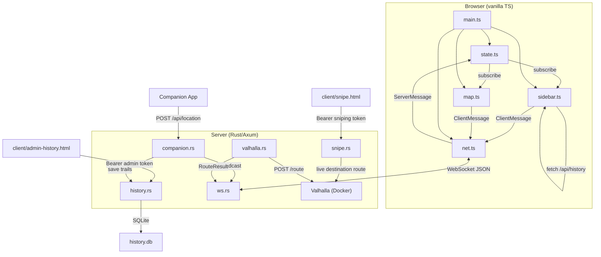
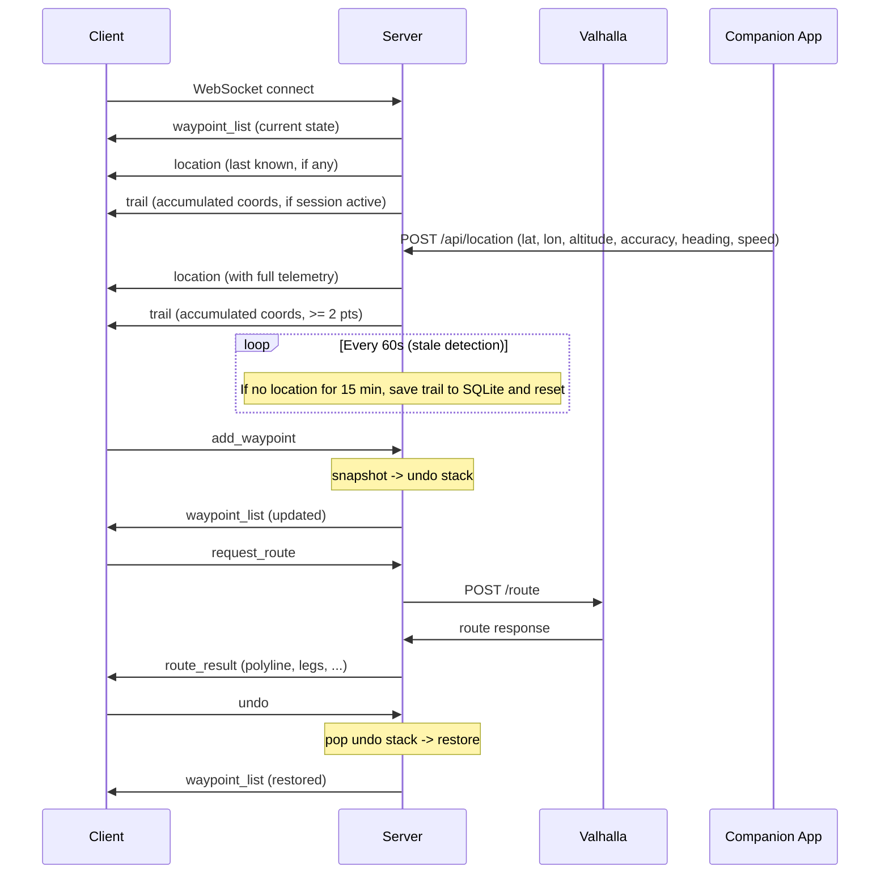

# Architecture

## Overview

KatMap is a client-server application communicating over a single WebSocket connection. The server is the source of truth for all waypoint state. Every connected client sees the same waypoints in real time. A companion app pushes GPS coordinates to the server via a REST endpoint.



## Wire Protocol

All messages are JSON objects with a `type` discriminator field, using `snake_case` names.

### Client → Server (`ClientMessage`)

| Type | Fields | Description |
|---|---|---|
| `add_waypoint` | `lat`, `lon`, `label` | Add a new waypoint (server assigns UUID) |
| `remove_waypoint` | `id` | Remove a waypoint by ID |
| `move_waypoint` | `id`, `lat`, `lon` | Move a waypoint to new coordinates |
| `rename_waypoint` | `id`, `label` | Change a waypoint's label |
| `reorder_waypoints` | `ordered_ids: string[]` | Reorder the waypoint list |
| `request_route` | — | Request route calculation via Valhalla |
| `request_live_route` | — | Request route from streamer live location through waypoints |
| `delete_all` | — | Delete all waypoints (pushes undo entry) |
| `undo` | — | Undo the last mutating operation |

### Server → Client (`ServerMessage`)

| Type | Fields | Description |
|---|---|---|
| `waypoint_list` | `waypoints: Waypoint[]` | Full waypoint state (sent after every mutation + on connect) |
| `location` | `lat`, `lon`, `timestamp_ms`, `display_name?`, `altitude?`, `accuracy?`, `altitude_accuracy?`, `heading?`, `speed?` | Streamer's live GPS position with full telemetry |
| `route_result` | `polyline`, `distance_km`, `duration_min`, `legs: RouteLeg[]` | Valhalla route calculation result |
| `live_route_result` | `polyline`, `distance_km`, `duration_min`, `legs`, `speed_kmh` | Route from streamer live location through waypoints |
| `error` | `message` | Error message |
| `trail` | `coords: [number, number][]` | Accumulated breadcrumb trail for history display |
| `live_status` | `live: boolean` | Whether the companion session is active |

### Data Types

```typescript
Waypoint     { id: string, lat: number, lon: number, label: string }
RouteLeg     { start_waypoint_id, end_waypoint_id, distance_km, duration_min, maneuvers: Maneuver[] }
Maneuver     { instruction, distance_km, duration_min, maneuver_type: number,
               street_names?: string[], begin_shape_index, end_shape_index }
BreadcrumbPoint { timestamp_ms, lon, lat, altitude?, accuracy?, altitude_accuracy?, heading?, speed? }
```

The `polyline` in `route_result` is Valhalla's **precision-6** encoded polyline (not Google's precision-5). Multi-leg routes are decoded, merged (deduplicating junction points), and re-encoded into a single polyline on the server.

## Server Architecture

### `main.rs` — Entry Point

Sets up tracing, reads environment variables, creates the shared `AppState`, spawns the stale-session detector, and starts the Axum HTTP server. The server serves:
- `/ws` — WebSocket endpoint
- `/api/config` — Server configuration (display name, social links)
- `/api/avatar` — Local avatar image loaded from `AVATAR_PATH`
- `/api/location` — Companion app location push (POST, requires API key)
- `/api/location/status` — Current trail status (GET)
- `/api/history` — Public stream history list (GET; applies non-destructive GPS edits)
- `/admin/history` — Redirects to the Vite-built `admin-history.html` history editor
- `/api/admin/history*` — Authenticated history editor and maintenance APIs
- `/snipe` — Redirects to the Vite-built `snipe.html` stream-sniping page
- `/api/snipe/*` — Authenticated stream-sniping GPS route APIs
- `/resolve-url` — Google Maps short link resolution
- `/discord` — Redirect to configured Discord invite
- Everything else — static files from `../client/dist/` (via `tower_http::services::ServeDir`)

### `ws.rs` — WebSocket Handler + State

**`AppState`** holds all shared mutable state:

| Field | Type | Description |
|---|---|---|
| `waypoints` | `Arc<RwLock<Vec<Waypoint>>>` | Canonical waypoint list |
| `undo_stack` | `Arc<RwLock<Vec<Vec<Waypoint>>>>` | Stack of previous waypoint states (max 50) |
| `tx` | `broadcast::Sender<ServerMessage>` | Fan-out channel to all WS clients |
| `connected_count` | `Arc<AtomicUsize>` | Connected client count |
| `history` | `Option<HistoryState>` | SQLite state for history persistence |
| `trail` | `Arc<Mutex<TrailAccumulator>>` | Active breadcrumb trail from companion app |
| `valhalla_url` | `String` | Valhalla routing engine URL |
| `companion_api_key` | `String` | API key for companion location push |
| `display_name` | `String` | Display name for location broadcasts |
| `avatar_path` | `String` | Local image served by `/api/avatar` |
| `social_links` | `SocialLinks` | Configured social media links |
| `live_location` | `Arc<RwLock<LiveLocation>>` | Latest valid streamer position for live routing/sniping |

**Connection lifecycle:**



**Undo system:**
- Before every mutating operation (add, remove, move, rename, reorder, delete-all), the current waypoint list is snapshot-cloned and pushed onto the undo stack
- `undo` pops the top of the stack and replaces the current waypoints
- The stack is capped at 50 entries (oldest dropped when full)
- Undo does not itself push an undo entry (no redo support)

**Broadcast model:**
All `ServerMessage`s go through the broadcast channel — there is no per-client unicast. This means route results and errors are visible to all connected clients. This is intentional for a collaborative tool.

### `companion.rs` — Companion App Location Tracker

Handles location pushes from the companion app and trail accumulation.

**Location push endpoint** (`POST /api/location`):
- Accepts `{ type: "location", lat, lon, timestamp_ms?, altitude?, accuracy?, altitude_accuracy?, heading?, speed? }`
- Validates the `Authorization: Bearer <key>` header against `COMPANION_API_KEY`
- Stores `BreadcrumbPoint` structs (timestamp + full telemetry) in the `TrailAccumulator`
- Inserts points in timestamp order; out-of-order packets trigger a sorted full-trail rebroadcast
- Broadcasts `ServerMessage::Location` (with telemetry) and `ServerMessage::Trail` (coordinate pairs)

**`TrailAccumulator`** manages the active session:
- `points: Vec<BreadcrumbPoint>` — accumulated breadcrumb points with timestamped telemetry
- `insert_sorted()` inserts by timestamp and detects out-of-order arrivals
- `coords()` helper extracts `[lon, lat]` pairs for the `trail` message
- Auto-starts a session on first location push
- `stale_detector` task runs every 60s — if no location for 15 minutes, saves trail to SQLite and resets
- `save_on_shutdown` saves any active trail on graceful shutdown (Ctrl+C)

**Status endpoint** (`GET /api/location/status`):
- Returns current session state: active, point count, session name, start time

### Avatar and Config

`main.rs` serves `/api/config` directly and `/api/avatar` from a local file path. The avatar path comes from `AVATAR_PATH` and defaults to `/opt/katmap/avatar.png`. There is no Twitch API dependency in the backend.

### `history.rs` — SQLite Stream History + Web Editor

Stores completed breadcrumb trails with full telemetry:

```sql
CREATE TABLE IF NOT EXISTS streams (
    id              INTEGER PRIMARY KEY AUTOINCREMENT,
    streamer_id     TEXT NOT NULL,
    platform        TEXT NOT NULL,        -- "companion"
    started_at      INTEGER NOT NULL,     -- Unix timestamp ms
    ended_at        INTEGER NOT NULL,
    stream_title    TEXT,
    viewer_count    INTEGER,
    breadcrumbs     TEXT NOT NULL,         -- JSON [[lon, lat], ...]
    completed       INTEGER NOT NULL DEFAULT 0,
    session_id      TEXT,
    hidden          INTEGER NOT NULL DEFAULT 0,
    telemetry       TEXT,                  -- JSON [BreadcrumbPoint, ...]
    trail_edits     TEXT                   -- JSON { hidden_indices, moved_points }
);
```

The `telemetry` column stores the full `BreadcrumbPoint` array with timestamp, altitude, accuracy, heading, and speed per point. When a trail goes stale or the server shuts down, the trail is saved here.

The `trail_edits` column stores non-destructive GPS cleanup from `/admin/history`:

```typescript
TrailEdits {
  hidden_indices: number[];                 // original point indices omitted from display
  moved_points: Record<number, [lon, lat]>; // original point index -> replacement coordinate
}
```

Public `/api/history` applies these edits when returning entries, while preserving the original `breadcrumbs` JSON.

**Authenticated web editor:** `/admin/history` uses bearer auth (`ADMIN_API_KEY`, falling back to `COMPANION_API_KEY`) and supports listing, renaming, hiding/unhiding, deleting, moving GPS points, hiding GPS points, per-point reset, and discard-all-edits.

### `snipe.rs` — Stream Sniping Routes

Provides an authenticated private GPS page at `/snipe` backed by `/api/snipe/status` and `/api/snipe/route`. Auth uses `SNIPING_API_KEY` only.

- Browser GPS is the route origin
- Streamer's latest live location is the fixed destination
- Route recalculates as the browser or streamer moves
- Valhalla costing modes: `pedestrian`, `bicycle`, `auto` exposed as walking/cycling/car
- Server-side state is stateless per request, so multiple snipers do not share route state

### `resolve.rs` — URL Resolution Endpoint

A simple `GET /resolve-url?url=<encoded>` HTTP endpoint used by the client to resolve Google Maps short links (`maps.app.goo.gl`, `goo.gl/maps`) into full URLs from which coordinates can be extracted.

- Allows only Google Maps hostnames to prevent open-redirect abuse
- Uses `reqwest` with `redirect::Policy::limited(10)` to follow redirects
- Returns `{ "url": "<final_url>" }` or `{ "error": "<message>" }`

### `valhalla.rs` — Route Proxy

Called from `ws.rs` when a `request_route` message is received. It:
1. Takes the current waypoint list (needs >= 2)
2. POSTs to `{VALHALLA_URL}/route` with `costing: "pedestrian"` and configurable `walking_speed`
3. For multi-leg routes, decodes each leg's precision-6 polyline, merges them (skipping duplicate junction points), and re-encodes into a single polyline
4. Maps maneuver shape indices to account for the merged polyline offset
5. Returns `RouteResult` which is broadcast as `ServerMessage::RouteResult`

Route calculation runs in a spawned task so it doesn't block the WebSocket handler.

### `admin.rs` — History DB CLI

A standalone binary (`katmap-admin`) for SQLite history maintenance. Reads `HISTORY_DB_PATH` env var for the database path. Operations include listing streams, hiding entries, and deleting records.

## Client Architecture

### `main.ts` — Entry Point

Instantiates and wires together all components:
- Creates `AppState`, `Connection`, `MapView`, `Sidebar`
- Manages theme persistence via `localStorage` (key: `katmap-theme`)
- Handles mobile sidebar toggle (hamburger button, overlay, Escape key)
- Keyboard shortcut: `Ctrl+Z` / `Cmd+Z` sends `{ type: "undo" }`
- Auto-route: when waypoints change (compared by serializing `[id, lat, lon]`), clears the stale route and sends `request_route` if >= 2 waypoints
- Dynamic favicon: circular `/api/avatar` image, fallback teal "K" circle
- Toast notification system (error: 5s red, success: 2s green, info: 2s themed)

### `state.ts` — Reactive Store

Simple observable store with pub/sub:
- **Fields**: `waypoints`, `location`, `route`, `connected`, `lastError`, `errorTimestamp`
- **`subscribe(listener)`**: returns an unsubscribe function, called on every state change
- **`applyServerMessage(msg)`**: dispatches on message type, updates state, notifies subscribers
- **Helpers**: `setConnected()`, `setError()`, `clearError()`, `clearRoute()`

### `net.ts` — WebSocket Connection

Manages the WebSocket lifecycle:
- Connects to `ws(s)://${location.host}/ws`
- On message: JSON-parses into `ServerMessage`, calls the `onMessage` callback
- On close: schedules reconnect with exponential backoff (1s initial, 30s max)
- **`send(msg)`**: JSON-encodes and sends if the socket is open
- On reconnect, the server sends the full waypoint state, so the client is immediately in sync

### `map.ts` — MapView

Wraps MapLibre GL JS with all map interaction logic:

**Themes**: 8 vector tile themes fetched from the tile server (dark-matter, positron, osm-bright, fiord-color, toner, basic, neon-night, midnight-blue) plus a raster fallback using OpenStreetMap tiles. On theme change, the style is fully replaced via `map.setStyle()`, and all custom layers/sources are re-added.

**Layers**:
- Route polyline: GeoJSON `LineString` source, teal color (`#0f9b8e`), decoded from Valhalla precision-6 polyline
- Waypoint markers: MapLibre `Marker` instances (numbered teal circles), draggable — `dragend` sends `move_waypoint`
- Streamer marker: avatar from `/api/avatar` in a 40px circle, or a red dot fallback
- Live breadcrumb trail: warm gradient line with dark casing and start/end endpoint dots
- History trail: cold gradient line with dark casing and start/end endpoint dots

**Interactions**:
- Right-click on map: context menu with "Add waypoint here" (reverse geocoded label via Nominatim), "Open in Google Maps"
- Right-click on marker: "Set as start", "Set as end", "Open in Google Maps", "Delete node"
- Map interaction is disabled while the context menu is open
- Right-click drag rotation is permanently disabled (`dragRotate: false`)
- Mobile: long-press (500ms) triggers the context menu; tap on markers opens marker context menu

**Follow mode**: `setFollow(on)` / `getFollow()`. When enabled, the map eases to the streamer's position on every location update. Auto-disables on manual drag.

**Exports**: `reverseGeocode(lat, lon)` — calls Nominatim, returns street address or null (only results with `place_rank >= 26`).

### `sidebar.ts` — Sidebar Panel

Renders the left panel with:
- **Header**: "KatMap" title with connection status dot, streamer live/offline indicator
- **Add streamer location**: button (visible when session is active) that adds a waypoint at the streamer's current position with a reverse-geocoded label, then reorders it to first position. 5-second cooldown.
- **Action bar**: "Undo" and "Delete all" buttons. Delete-all is disabled when the waypoint list is empty.
- **History browser**: Expandable panel listing past streams from the SQLite history. Each entry shows platform icon, date/time, duration, and coordinate count. Clicking an entry displays that trail on the map.
- **Waypoint input**: A text field + "+" button for adding a waypoint by pasting/typing. Supports:
  - `lat, lon` plain coordinate pairs (e.g. `34.0522, -118.2437`)
  - Full Google Maps URLs (coordinates extracted from the `@lat,lon` or `?q=lat,lon` in the URL)
  - Google Maps short links (`maps.app.goo.gl/...`, `goo.gl/maps/...`) — resolved server-side via `/resolve-url`
  - Plus Codes — decoded with the `open-location-code` library; short codes use the streamer's current location as a reference point
- **Waypoint list**: SortableJS-powered drag-to-reorder list. Each item shows index number, label (click to inline-edit), coordinates, and a remove button.
- **Route info**: Summary (total distance/duration), then per-leg maneuver lists with icons (44 Valhalla maneuver types mapped to Unicode symbols), instructions, street names, and distances.

### `types.ts` — Wire Protocol Types

TypeScript interfaces and discriminated unions that mirror the server's Rust types exactly. Kept in sync manually.

### `style.css` — Styling

Dark-themed CSS with CSS custom properties:
- Layout: flexbox, sidebar (320px fixed) + map (flex: 1)
- Responsive: `@media (max-width: 768px)` — sidebar becomes a fixed overlay slide-in drawer with hamburger toggle
- Color scheme: navy backgrounds, teal accent (`#0f9b8e`), red for danger actions
- MapLibre control overrides for dark theme (inverted icons, dark backgrounds)

## Key Design Decisions

**No waypoint persistence.** All waypoint and undo state is in-memory and lost on server restart. This is intentional — the app is ephemeral by nature (route plans for a live stream session).

**Stream history is persisted.** Completed breadcrumb trails are saved to SQLite when the trail goes stale (15 minutes without location update) or when the server shuts down. History is browsable in the sidebar. Full telemetry (altitude, accuracy, heading, speed) is stored per point.

**Server-authoritative.** The server owns the canonical waypoint list. Clients send mutation requests and receive the full updated list back. There is no optimistic client-side state — the UI waits for the server echo.

**Broadcast-only.** All server messages go through a `tokio::sync::broadcast` channel to all connected clients. There is no per-client messaging. This keeps the architecture simple and means all clients always see the same state.

**No framework.** The client is vanilla TypeScript with direct DOM manipulation. The UI is simple enough (a map + a sidebar) that a framework would add more complexity than value.

**Undo is server-side.** The undo stack lives on the server so all clients share the same undo history. Any client can undo any other client's action.
