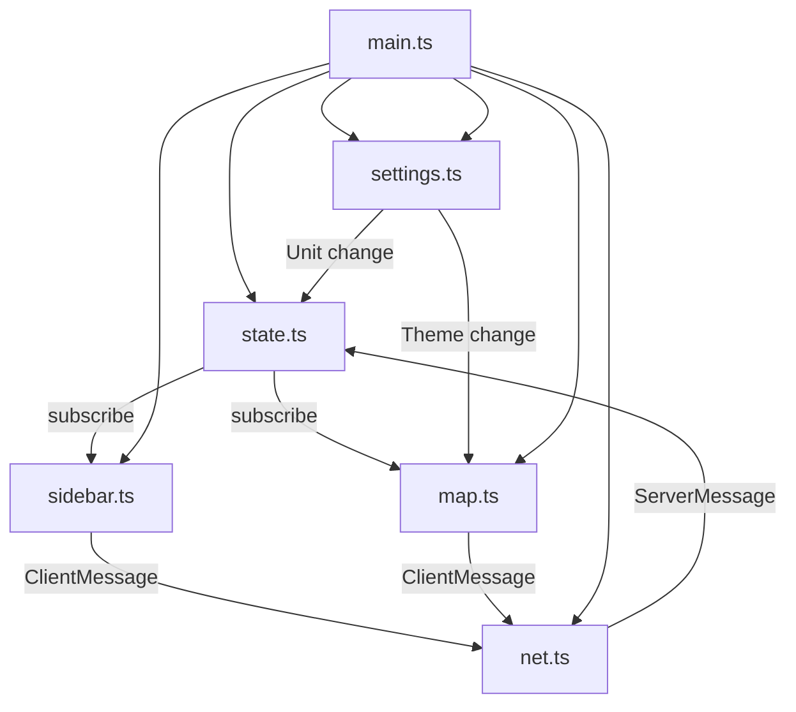

# Client Internals

The client is **vanilla TypeScript + Vite + MapLibre GL JS** with no framework. Direct DOM manipulation throughout.

## Component Architecture

## Key Module Reference

| Module | Purpose |
|---|---|
| `main.ts` | Entry, wiring, theme persistence, sidebar toggle, shortcuts, auto-route, toast, favicon |
| `state.ts` | Reactive pub/sub store |
| `net.ts` | WebSocket client |
| `map.ts` | MapLibre GL JS wrapper |
| `sidebar.ts` | Sidebar panel |
| `types.ts` | Wire protocol types |
| `themes.ts` | Theme definitions, fetching, PMTiles (shared) |
| `settings.ts` | Settings popup modal |
| `strings.ts` | All user-facing text |
| `units.ts` | Metric/imperial conversions |
| `geo.ts` | Coordinate types and distance math |
| `style.css` | Dark-themed styles |

### `main.ts` — Entry Point & Wiring

Instantiates all components and wires them together:

- Creates `AppState`, `Connection`, `MapView`, `Sidebar`, `SettingsPopup`
- **Theme persistence**: reads `katmap-theme` from `localStorage`, initializes the map, restores on load
- **Unit persistence**: reads `katmap-units` from `localStorage` (metric/imperial per measurement type)
- **Settings popup**: gear icon opens `SettingsPopup` — theme select + distance/speed/altitude unit toggles
- **Mobile sidebar**: hamburger button toggle, overlay click-to-close, Escape key to close
- **Keyboard shortcut**: `Ctrl+Z` / `Cmd+Z` sends `{ type: "undo" }`
- **Auto-route**: watches waypoint changes (serializes `[id, lat, lon, active]` per waypoint), clears stale route, sends `request_route` if ≥2 active waypoints
- **Dynamic favicon**: renders the `/api/avatar` image into a circular canvas favicon, falls back to a teal "K" circle
- **Update polling**: periodically fetches `/api/version` and shows a reload toast if a new build is deployed
- **Toast notifications**: error (red, 5s), success (green, 2s), info (themed, 2s) with cooldown on repeated identical errors

### `state.ts` — Reactive Store

Simple observable pub/sub store:

**Fields**:
- `waypoints: Waypoint[]`
- `location: LocationData | null`
- `route: RouteResult | null`
- `liveRoute: RouteResult | null`
- `connected: boolean`
- `userCount: number`
- `lastError: string | null`
- `units: UserUnits`

**API**:
- `subscribe(listener: Listener): () => void` — returns unsubscribe function
- `applyServerMessage(msg: ServerMessage)` — dispatches by message type, updates state, notifies all subscribers
- `setUnits(units: UserUnits)` — updates units and persists to `localStorage`

### `net.ts` — WebSocket Client

Manages the WebSocket lifecycle:

- **Connect**: `ws(s)://${location.host}/ws` (auto-detects wss:// on HTTPS)
- **Overlay**: append `?client=overlay` to opt out of viewer counting
- **On message**: JSON-parses into `ServerMessage`, calls `onMessage` callback
- **On close**: schedules reconnect with exponential backoff (1s initial, 30s max, jittered)
- **`send(msg: ClientMessage)`**: JSON-encodes and sends if socket is `OPEN`
- **Reconnect sync**: on reconnect, the server sends full `waypoint_list` + last `location` + active `trail` + `live_status`

### `map.ts` — MapView

Wraps MapLibre GL JS with all map interaction logic. Theme application is delegated to `themes.ts`.

**Layers & Markers**:
- **Route polyline**: GeoJSON `LineString` source, teal (`#0f9b8e`) with slight opacity. Separate layers for main route and live route
- **Waypoint markers**: MapLibre `Marker` instances, numbered teal circles, draggable (`dragend` → `move_waypoint`). Active/inactive styling differs
- **Streamer marker**: `/api/avatar` in a 40px circle with teal ring, or a red circle fallback
- **Live breadcrumb trail**: warm gradient line with dark casing, start point (green dot), end point (blue dot)
- **History trail**: cold gradient line with dark casing, start/end endpoint dots

**Interactions**:
- **Right-click on map**: context menu — "Add waypoint here" (reverse geocoded), "Open in Google Maps"
- **Right-click on marker**: context menu — "Set as start", "Set as end", "Mark active/inactive", "Open in Google Maps", "Delete node"
- Map interaction is disabled while context menu is open
- Right-click drag rotation is permanently disabled (`dragRotate: false`)

**POI popup**: clicking on the map (non-marker area) queries `/api/poi?lat=...&lon=...` for nearby points of interest. Results cached server-side for 1 hour. Popup shows hours, phone, website, cuisine, accessibility info, and "Add to route" button.

**Mobile**:
- Long-press (≥500ms, <10px move) triggers the map context menu
- Tap on waypoint markers opens the marker context menu
- Separate code paths from desktop

**Follow mode**: `setFollow(on)` / `getFollow()`. When enabled, the map eases to the streamer's position on every `location` update. Auto-disables on manual map drag.

**Reverse geocoding**: `reverseGeocode(lat, lon)` calls Nominatim (`https://nominatim.openstreetmap.org/reverse`), returns the street address or `null`. Only results with `place_rank >= 26` (street level or more specific) are accepted.

### `sidebar.ts` — Sidebar Panel

Renders the full left panel:

**Header**: "KatMap" title, connection status dot (green/red), user count, streamer live/offline indicator.

**Add streamer location button**: visible when session is active, adds a waypoint at the streamer's current position with a reverse-geocoded label, reorders it to first position. 5-second cooldown between clicks.

**Action bar**: "Undo" and "Delete all" buttons. Delete-all is disabled when the waypoint list is empty.

**History browser**: expandable panel listing past streams from SQLite (`GET /api/history`). Each entry shows platform icon, date/time, duration, coordinate count. Clicking an entry displays that trail on the map as a cold gradient line.

**Waypoint input**: text field + "+" button. Accepts:
- Plain coordinates: `lat, lon` (e.g. `34.0522, -118.2437`)
- Full Google Maps URLs: extracts coordinates from `@lat,lon` or `?q=lat,lon`
- Google Maps short links: `maps.app.goo.gl/...`, `goo.gl/maps/...` — resolved server-side via `GET /resolve-url`
- Plus Codes: decoded with the `open-location-code` library; short codes use the streamer's current location as a reference point

**Waypoint list**: SortableJS-powered drag-reorder. Each item shows:
- Index number (drag handle, teal circle with number)
- Active/inactive toggle (affects route inclusion, undo-supported)
- Label (click to inline-edit with text input)
- Coordinates (display only)
- Remove button (×)

The drag handle is intentionally limited to `.waypoint-index` to keep labels and buttons clickable.

**Route info**: shows summary (total distance + duration), then per-leg maneuver list with:
- Icons: 44 Valhalla maneuver types mapped to Unicode symbols
- Instructions (plain text)
- Street names (if available)
- Distance per leg (format respects current unit system)

**Live route info**: when the streamer is live, a "Live ETA" section appears showing remaining distance, time, and speed using the streamer's current speed. Only waypoints ahead of the streamer are included.

### `themes.ts` — Theme Module (Shared)

Centralized theme management used by all pages:

- **`THEMES`**: `const` array of all theme short names
- **`Theme`**: type derived from `THEMES`
- **`THEME_FILE`**: maps theme → style JSON filename
- **`RASTER_STYLE`**: inline MapLibre style for OSM raster fallback
- **`fetchStyle(theme)`**: fetches style JSON from the tile server
- **`applyTheme(map, theme, onLoad?)`**: applies vector style with raster fallback. Calls `onLoad` after `style.load` so custom layers can be re-added
- **`registerPmtiles()`**: registers PMTiles protocol globally (safe to call multiple times)
- **`isTheme(value)`**: type guard

### `settings.ts` — Settings Popup

Modal overlay (`SettingsPopup` class) opened by a gear icon:

- **Theme selector**: `<select>` populated from `THEMES` array, labels from `strings.themes`
- **Unit toggles**: per-measurement type (distance, speed, altitude) — metric/imperial. Values persisted to `localStorage` via `state.ts`

### `strings.ts` — Centralized Strings

All user-facing text in a single `strings` object. Includes:
- App title, sidebar labels, waypoint labels
- Route/ETA formatting templates
- Context menu labels
- History panel text
- POI popup labels
- Social link labels + icons
- Map control tooltips
- Theme display names
- Overlay status labels
- Toast messages
- Help/onboarding card text

### `units.ts` — Unit System

Separates measurement types for independent metric/imperial toggling:
- `distance`: km/m vs mi/ft
- `speed`: km/h vs mph
- `altitude`: m vs ft

Each has conversion helpers (`kmToMi`, `kmhToMph`, `mToFt`, etc.) and formatters (`formatDistance`, `formatSpeed`, `formatAltitude`). Default is metric; the overlay always uses imperial via `IMPERIAL_UNITS`.

### `geo.ts` — Coordinate Utilities

- `LonLat` type: `[lon, lat]` tuple
- `LatLon` type: `[lat, lon]` tuple
- `haversineMeters(from, to)`: Haversine distance between two `LonLat` points
- `distanceMeters(a, b)`: Distance between two `LatLonLocation` objects
- `formatDistanceKm(km)`: Simple km/m formatting

### `style.css`

Dark-themed CSS with CSS custom properties:
- **Layout**: flexbox, sidebar (320px fixed width) + map (flex: 1)
- **Responsive**: `@media (max-width: 768px)` — sidebar becomes a fixed overlay slide-in drawer with hamburger toggle
- **Settings popup**: centered modal overlay with backdrop
- **Color scheme**: navy backgrounds (`#0d1117`, `#161b22`), teal accent (`#0f9b8e`), red danger, warm amber for streamer elements
- MapLibre control overrides for dark theme (inverted icons, dark backgrounds)
