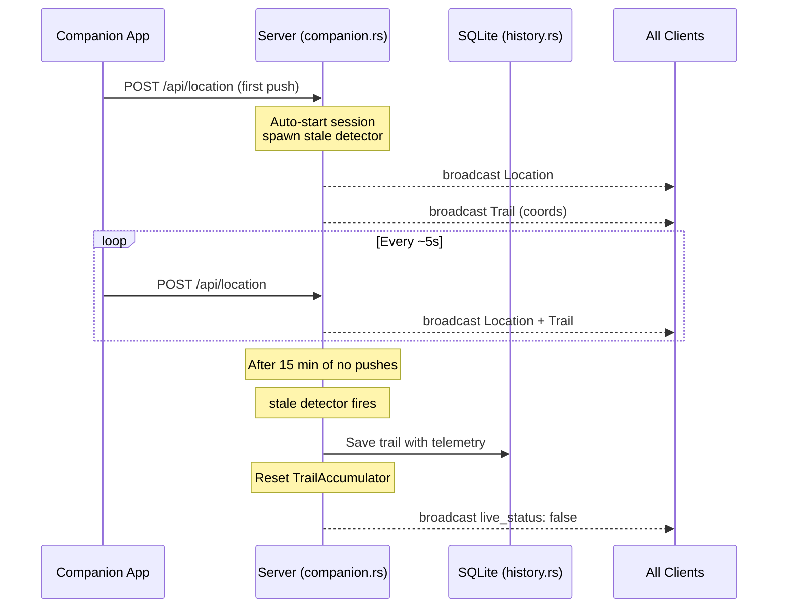

# Companion App (Location Tracking)

Location data comes from a companion app (mobile device or browser with GPS) that pushes coordinates to the server via `POST /api/location`.

## Endpoints

### POST /api/location

**Auth**: `Authorization: Bearer <COMPANION_API_KEY>`

**Request body**:
```json
{
  "type": "location",
  "lat": 47.6062,
  "lon": -122.3321,
  "timestamp_ms": 1715097600000,
  "altitude": 100.5,
  "accuracy": 5.0,
  "altitude_accuracy": 10.0,
  "heading": 180.0,
  "speed": 1.5
}
```

All fields except `lat` and `lon` are optional. The companion sends the full set of [GeolocationCoordinates](https://developer.mozilla.org/en-US/docs/Web/API/GeolocationCoordinates) properties.

The server also tracks the last 200 location pushes in a `VecDeque` for the `/api/debug/location-pushes` debug endpoint.

### GET /api/location/status

Returns current session state:
```json
{
  "active": true,
  "point_count": 342,
  "session_name": "2026-05-07 12:00:00 UTC",
  "started_at": 1715097600000
}
```

## Implemented in: `server/src/companion.rs`

### TrailAccumulator

The `TrailAccumulator` struct manages the active session:

```rust
struct TrailAccumulator {
    points: Vec<BreadcrumbPoint>,  // accumulated breadcrumbs with full telemetry
    session_name: String,          // auto-generated from session start time
    session_id: Option<String>,    // unique session identifier
    started_at: Option<i64>,       // Unix timestamp ms of first point
    last_location_ts: i64,         // Unix timestamp ms of most recent point
    last_location: Option<(f64, f64)>, // (lat, lon) of most recent point
    session_active: bool,
    stale_detector_shutdown: Option<oneshot::Sender<()>>,
}
```

### Point Insertion

- `insert_sorted(lat, lon, timestamp_ms, altitude?, accuracy?, altitude_accuracy?, heading?, speed?)`:
  1. Creates a `BreadcrumbPoint` with full telemetry
  2. Inserts it in timestamp order (binary search for insertion point)
  3. If the point sorted into a position that isn't the end, all points are rebroadcast in chronological order to fix the trail
  4. Updates `last_location` and `last_location_ts`
  5. Auto-starts a new session on first point (creates `session_id`, spawns stale detector)

### Session Lifecycle



- **Auto-start**: Session begins on the first location push after a reset
- **Stale detection**: A background task runs every 60 seconds; if the session is active and the last location is more than 15 minutes old, the trail is finalized and saved
- **Graceful shutdown**: On `Ctrl+C` or SIGTERM, active trails are saved to SQLite via `save_on_shutdown`
- **Reset**: After saving, the accumulator is cleared and ready for the next session

### Incomplete Trail Recovery

On server startup, `main.rs` checks for incomplete companion trails in SQLite (trails where `completed = 0`). If one exists and ended within the last 15 minutes, the `TrailAccumulator` resumes from that state so breadcrumb lines continue across restarts. Older incomplete trails are marked complete.

### Auto-Complete Waypoints

When `AUTO_COMPLETE_WAYPOINTS` is enabled (default: yes), the companion handler checks if the streamer is near any active waypoints:

1. For each active waypoint within `AUTO_COMPLETE_WAYPOINT_RADIUS_M` meters (default: 35m)
2. If the streamer stays within range for `AUTO_COMPLETE_WAYPOINT_DWELL_S` seconds (default: 10s)
3. The waypoint is automatically set `active: false`
4. The change is broadcast as a `waypoint_list` update (and can be undone)

### Telemetry Persistence

When a trail is saved to `history.db`, full telemetry is stored in the `telemetry` JSON column as an array of `BreadcrumbPoint` objects. Each includes: `timestamp_ms`, `lon`, `lat`, `altitude?`, `accuracy?`, `altitude_accuracy?`, `heading?`, `speed?`.

The simplified coordinate pairs (`[lon, lat]`) used for map display are stored in the `breadcrumbs` column.
