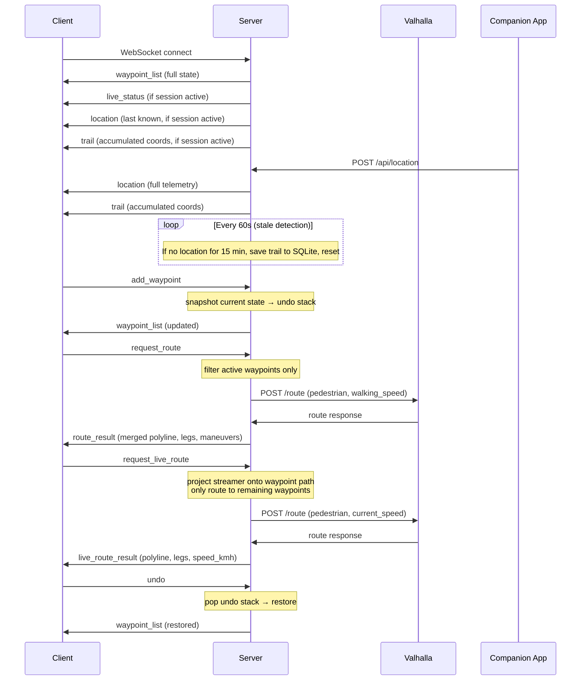

# Server Internals

The server is a Rust/Axum application that runs on a single port. It serves WebSocket connections, REST endpoints, static files, and proxies routing requests to Valhalla.

## AppState

All shared mutable state lives in `AppState` (defined in `ws.rs`):

| Field | Type | Description |
|---|---|---|
| `waypoints` | `Arc<RwLock<Vec<Waypoint>>>` | Canonical waypoint list |
| `undo_stack` | `Arc<RwLock<Vec<Vec<Waypoint>>>>` | Stack of previous waypoint states (max 50) |
| `tx` | `broadcast::Sender<ServerMessage>` | Fan-out broadcast channel to all WS clients |
| `connected_count` | `Arc<AtomicUsize>` | Number of WebSocket clients counted as viewers (excludes overlays) |
| `valhalla_url` | `String` | Valhalla routing engine URL |
| `walking_speed_kmh` | `f64` | Default pedestrian speed for route estimates |
| `companion_api_key` | `String` | API key for companion location push auth |
| `display_name` | `String` | Display name for location broadcasts |
| `avatar_path` | `String` | Local file path served by `/api/avatar` |
| `history` | `Option<&'static HistoryState>` | SQLite connection + state for history persistence |
| `social_links` | `SocialLinks` | Configured social media links (Discord, Kick, Twitch) |
| `trail` | `Arc<Mutex<TrailAccumulator>>` | Active breadcrumb trail from companion app |
| `live_location` | `Arc<RwLock<LiveLocation>>` | Latest valid streamer position + speed for live routing/sniping |
| `snipe_route_limiter` | `Arc<SnipeRouteLimiter>` | Rate limiter for the sniping route endpoint |
| `poi_cache` | `Arc<RwLock<PoiCache>>` | POI lookup cache (1-hour TTL, keyed by lat/lon/name) |
| `recent_location_pushes` | `Arc<Mutex<VecDeque<...>>>` | Last 200 companion location pushes for debug |
| `auto_complete` | `AutoCompleteConfig` | Auto-complete settings (enabled, radius, dwell time) |
| `auto_complete_candidate` | `Arc<Mutex<Option<...>>>` | Current auto-complete candidate waypoint |

## Route Table

All routes registered in `main.rs`:

| Method | Path | Handler | Description |
|---|---|---|---|
| GET | `/ws` | `ws.rs` | WebSocket upgrade. `viewer=0` excludes overlays from viewer count |
| GET | `/api/config` | `main.rs` (inline) | Server config: display name, social links |
| GET | `/api/avatar` | `main.rs` (inline) | Local avatar image (auto-detects MIME type) |
| GET | `/api/version` | `debug.rs` | Compile-time version metadata (`commit`, `build_time`) |
| GET | `/api/health` | `debug.rs` | Server health status (live session state, breadcrumb count) |
| GET | `/api/debug/location-pushes` | `debug.rs` | Recent companion location pushes snapshot |
| GET | `/debug/location-pushes` | `main.rs` (redirect) | Redirects to `debug-location-pushes.html` |
| POST | `/api/location` | `companion.rs` | Companion app location push (auth: `COMPANION_API_KEY`) |
| GET | `/api/location/status` | `companion.rs` | Active trail session status |
| GET | `/api/history` | `history.rs` | Public stream history list (applies non-destructive edits) |
| GET | `/api/poi` | `poi.rs` | POI lookup via Overpass API (cached, 1h TTL) |
| GET | `/admin/history` | `main.rs` (redirect) | Redirects to `admin-history.html` |
| GET | `/api/admin/history` | `history.rs` | List all history entries (auth: `ADMIN_API_KEY` or `COMPANION_API_KEY`) |
| PATCH | `/api/admin/history/{id}` | `history.rs` | Update history entry (rename, hide/unhide) |
| DELETE | `/api/admin/history/{id}` | `history.rs` | Delete a history entry |
| PUT | `/api/admin/history/{id}/edits` | `history.rs` | Save non-destructive trail edits |
| GET | `/snipe` | `main.rs` (redirect) | Redirects to `snipe.html` |
| GET | `/api/snipe/status` | `snipe.rs` | Current streamer location (auth: `SNIPING_API_KEY`) |
| POST | `/api/snipe/route` | `snipe.rs` | Route from browser GPS to streamer (auth: `SNIPING_API_KEY`, rate-limited) |
| GET | `/resolve-url` | `resolve.rs` | Google Maps short link resolution |
| GET | `/discord` | `main.rs` (inline) | Redirect to configured Discord invite (404 if not set) |
| * | `/*` | `tower_http::ServeDir` | Static files from `../client/dist/` |

## WebSocket Lifecycle



### Viewer Counting

- Main app connections increment `connected_count`
- Overlay connections (`viewer=0`, or known overlay client tags) receive `user_count` messages but don't increment the count
- `UserCount` messages are broadcast on every connect/disconnect

## Undo System

- Before every mutating operation (`add_waypoint`, `remove_waypoint`, `move_waypoint`, `rename_waypoint`, `set_waypoint_active`, `reorder_waypoints`, `delete_all`), the current waypoint list is deep-cloned and pushed onto the undo stack
- `undo` pops the top of the stack and replaces current waypoints; the restored state is broadcast as `waypoint_list`
- Stack capacity: **50 entries** (oldest dropped when full)
- Undo does **not** push an undo entry (no redo support)
- The undo stack is shared across all clients (any client can undo any action)

## Broadcast Model

All server messages go through `tokio::sync::broadcast`:

```rust
// In AppState
tx: broadcast::Sender<ServerMessage>

// Sending (from any handler)
let _ = state.tx.send(ServerMessage::WaypointList { waypoints: ... });
```

- Every connected WebSocket task holds a `broadcast::Receiver`
- Messages are fanned out to all receivers
- There is **no per-client messaging** — route results and errors are visible to all clients
- `broadcast::channel` capacity is 256; slow clients get lagged and disconnected (they'll reconnect and get fresh state)

## Valhalla Route Proxy

`valhalla.rs` handles route calculation:

1. Receives the waypoint list from `AppState` (needs ≥2 active waypoints)
2. POSTs to `{VALHALLA_URL}/route` with:
   - `costing: "pedestrian"`
   - `walking_speed` from env var or caller-specified speed
   - Waypoint coordinates as locations
3. For multi-leg responses:
   - Decodes each leg's **precision-6** polyline
   - Merges polylines (skipping duplicate junction points)
   - Re-encodes into a single polyline
   - Remaps `begin_shape_index` / `end_shape_index` on all maneuvers
4. Returns `RouteResult` which is broadcast as `ServerMessage::RouteResult`

## Live Route Logic

When `request_live_route` is received (in `ws.rs`):

1. Reads the streamer's current `LiveLocation` (must be valid)
2. Converts GPS speed (m/s) to km/h; falls back to `walking_speed_kmh`
3. Projects the streamer's position onto the waypoint path to determine which waypoints are ahead
4. Only routes through remaining waypoints (avoids routing back to already-passed waypoints)
5. Creates a virtual waypoint at the streamer's position as the route origin
6. Returns `LiveRouteResult` including the current `speed_kmh`

The `remaining_waypoints_for_live_route()` function projects the origin onto each waypoint segment and keeps waypoints from the best-matching segment forward.

## Auto-Complete

When `AUTO_COMPLETE_WAYPOINTS` is enabled (default: yes), the companion handler auto-deactivates waypoints when the streamer passes through them:

- `auto_complete_radius_m`: distance threshold in meters (default: 35)
- `auto_complete_dwell_s`: time the streamer must stay within range (default: 10s)
- When a waypoint's deactivation candidate timer expires, it's set `active: false` and the change is broadcast

## POI Lookup

`poi.rs` proxies Overpass API queries:
- `GET /api/poi?lat=...&lon=...&name=...`
- Searches within 30m radius via Overpass
- Results cached in-memory for 1 hour (keyed by lat/lon/name)
- Returns nearby amenities, shops, tourism POIs with details (hours, phone, website, cuisine, accessibility)

## Debug Endpoints

`debug.rs` provides operational visibility:
- `GET /api/version` — compile-time git commit + build timestamp
- `GET /api/health` — current session state (live status, breadcrumb count, last location age)
- `GET /api/debug/location-pushes` — snapshot of the last 200 companion location pushes with received timestamps and full payloads

## Incomplete Trail Recovery

On server startup, `main.rs` checks for incomplete companion trails from the last 15 minutes. If found, the `TrailAccumulator` resumes from the saved state, so breadcrumb lines continue across server restarts.

## SQLite History Schema

```sql
CREATE TABLE IF NOT EXISTS streams (
    id              INTEGER PRIMARY KEY AUTOINCREMENT,
    streamer_id     TEXT NOT NULL,
    platform        TEXT NOT NULL,        -- "companion"
    started_at      INTEGER NOT NULL,     -- Unix timestamp ms
    ended_at        INTEGER NOT NULL,
    stream_title    TEXT,
    viewer_count    INTEGER,
    breadcrumbs     TEXT NOT NULL,         -- JSON [[lon, lat], ...]
    completed       INTEGER NOT NULL DEFAULT 0,
    session_id      TEXT,
    hidden          INTEGER NOT NULL DEFAULT 0,
    telemetry       TEXT,                  -- JSON [BreadcrumbPoint, ...]
    trail_edits     TEXT                   -- JSON { hidden_indices, moved_points }
);
```

Key points:
- `breadcrumbs` is the original coordinate array — **never modified** by admin edits
- `telemetry` stores full `BreadcrumbPoint` arrays with timestamp, altitude, accuracy, heading, speed
- `trail_edits` stores non-destructive GPS edits — applied at read time by `/api/history`
- `session_id` links trail records to specific companion sessions

## Environment Variables

| Variable | Default | Description |
|---|---|---|
| `COMPANION_API_KEY` | — | API key for companion location push (**required**) |
| `SNIPING_API_KEY` | — | API key for `/snipe` and `/api/snipe/*` (required for sniping) |
| `ADMIN_API_KEY` | falls back to `COMPANION_API_KEY` | API key for `/admin/history` |
| `DISPLAY_NAME` | `streamer` | Display name in location broadcasts |
| `AVATAR_PATH` | `/opt/katmap/avatar.png` | Local avatar image for `/api/avatar` |
| `HISTORY_DB_PATH` | `/opt/katmap/history.db` | SQLite database path |
| `VALHALLA_URL` | `http://127.0.0.1:8002` | Valhalla routing engine URL |
| `WALKING_SPEED_KMH` | `5.1` | Pedestrian speed for route time estimates |
| `AUTO_COMPLETE_WAYPOINTS` | `true` | Enable auto-deactivation of reached waypoints |
| `AUTO_COMPLETE_WAYPOINT_RADIUS_M` | `35` | Distance threshold for auto-complete |
| `AUTO_COMPLETE_WAYPOINT_DWELL_S` | `10` | Dwell time for auto-complete |
| `SNIPE_ROUTE_LIMIT_PER_MINUTE` | `30` | Rate limit for snipe route requests |
| `SOCIAL_DISCORD` | — | Discord URL (enables `/discord` redirect) |
| `SOCIAL_KICK` | — | Kick profile URL |
| `SOCIAL_TWITCH` | — | Twitch profile URL |
| `RUST_LOG` | `debug` | Tracing filter (`info`, `debug`, `katmap_server=debug`) |
| `KATMAP_GIT_COMMIT` | auto/`unknown` | Compile-time git commit for `/api/version` |
| `KATMAP_BUILD_TIME` | `unknown` | Compile-time UTC timestamp for `/api/version` |
